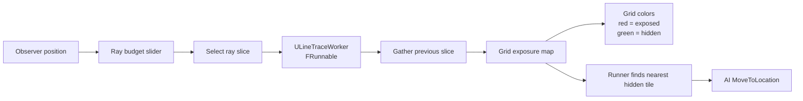

# Unreal Multithread Exposure Map

This is a hands-on Unreal Engine C++ experiment based on Allen Chou's articles
on [Delayed Result Gathering](https://allenchou.net/2021/05/delayed-result-gathering/)
and [Time Slicing](https://allenchou.net/2021/05/time-slicing/). It explores
deferred visibility queries using `FRunnable` workers, line traces, and
time-sliced result gathering.

> [!NOTE]
> The exposure map is a test case only. The goal is to experiment with deferred
> result gathering and time slicing in Unreal, not to build a production
> visibility system.

---

## Overview

An observer actor scans a grid with line traces. The work is split into slices,
results are gathered later, and the grid stores an exposure map:

- Red tiles are exposed to the observer.
- Green tiles are hidden by an obstacle.
- Runner AI moves toward the nearest hidden tile.

The important constraint is the same as the source articles: scheduling work and
consuming results are deliberately separated so the game thread does not do every
raycast in one blocking pass.

---

## Features

- Time-sliced line trace batches.
- Deferred result gathering across frames.
- `FRunnable` worker for trace batches.
- Runtime ray budget slider with `rays per slice / total rays` display.
- Grid exposure visualization.
- Runner AI that seeks the nearest non-exposed tile.
- Obstacle-aware grid generation with instanced mesh support.

---

## Implementation Notes

Key code paths:

- `Source/Multithread/Grid/Observer.*` owns the update loop. It gathers the
  previous trace slice, updates the exposure map when a full batch is complete,
  and schedules the next slice.
- `Source/Multithread/Grid/LineTraceWorker.h` runs a slice of line traces on an
  `FRunnable` worker and returns exposure results.
- `Source/Multithread/Grid/GridGenerator.*` builds the grid, tracks obstacle
  cells, stores the current exposure map, colors exposed/hidden tiles, and
  exposes hidden tile locations for AI.
- `Source/Multithread/MultithreadAIController.*` moves runners toward the
  nearest non-exposed tile.
- `Source/Multithread/RaysControl.*` backs the UMG slider and displays the
  resolved ray count per slice.

Exposure map convention:

- `true` means the observer has a clear line to the tile, so the tile is exposed.
- `false` means the ray hit an obstacle, so the tile is hidden.
