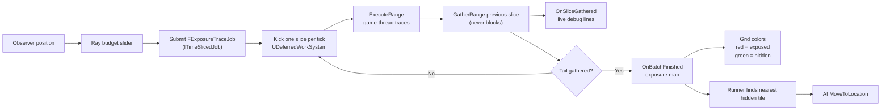

# Unreal Multithread Exposure Map

This is a hands-on Unreal Engine C++ experiment based on Allen Chou's articles
on [Delayed Result Gathering](https://allenchou.net/2021/05/delayed-result-gathering/)
and [Time Slicing](https://allenchou.net/2021/05/time-slicing/). It explores
deferred visibility queries using a generic `DeferredJobs` module
(`ITimeSlicedJob` + `UDeferredWorkSystem`), game-thread time-sliced line
traces, and live per-slice debug visualization.

> [!NOTE]
> The exposure map is a test case only. The goal is to experiment with deferred
> result gathering and time slicing in Unreal, not to build a production
> visibility system.

---

## Overview

An observer actor scans a grid with line traces. The work is split into slices,
results are gathered later, and the grid stores an exposure map:

- Red tiles are exposed to the observer.
- Green tiles are hidden by an obstacle.
- Runner AI moves toward the nearest hidden tile.

The important constraint is the same as the source articles: scheduling work and
consuming results are deliberately separated so the game thread does not do every
raycast in one blocking pass.

---

## Features

- Generic `DeferredJobs` module: `ITimeSlicedJob` jobs, tick-driven scheduler.
- Time-sliced line trace batches with delayed result gathering across frames.
- Game-thread trace slices (physics queries stay off worker threads).
- Live per-slice debug visualization: hit-aware ray stubs, impact dots, draw modes.
- Eye-height trace offset shared by tracing and drawing.
- `.ini`-tunable gather budgets (`GatherBudgetMs`, `MaxKicksPerTick`).
- Runtime ray budget slider with `rays per slice / total rays` display.
- Grid exposure visualization.
- Runner AI that seeks the nearest non-exposed tile.
- Obstacle-aware grid generation with instanced mesh support.

---

## Implementation Notes

Key code paths:

- [`Observer.cpp`](Source/Multithread/Grid/Observer.cpp#L165) owns the update
  loop. It submits one `FExposureTraceJob` sweep per grid pass, draws each
  gathered slice live at [`#L221`](Source/Multithread/Grid/Observer.cpp#L221),
  and applies the full exposure map on batch completion at
  [`#L229`](Source/Multithread/Grid/Observer.cpp#L229). Shared draw helper at
  [`#L280`](Source/Multithread/Grid/Observer.cpp#L280).
- [`ExposureTraceJob.h`](Source/Multithread/Public/Jobs/ExposureTraceJob.h)
  implements the `ITimeSlicedJob` contract: snapshot inputs at construction,
  trace one slice in `ExecuteRange`, merge it in `GatherRange`, report per-slice
  debug records for live drawing, swap buffers in `OnBatchFinished`.
- [`DeferredWorkSystem`](Source/DeferredJobs/Public/DeferredWorkSystem.h) owns
  all batches: gather-if-ready, kick one slice per tick, finish on the tail
  signal. Never blocks the game thread. See
  [`Source/DeferredJobs/README.md`](Source/DeferredJobs/README.md) for the
  module contract, thread policies, and tuning.
- [`GridGenerator.cpp`](Source/Multithread/Grid/GridGenerator.cpp#L66) builds
  the grid, tracks obstacle cells, stores the current exposure map, colors
  exposed/hidden tiles at [`#L237`](Source/Multithread/Grid/GridGenerator.cpp#L237),
  and exposes hidden tile locations at
  [`#L218`](Source/Multithread/Grid/GridGenerator.cpp#L218).
- [`MultithreadAIController.cpp`](Source/Multithread/MultithreadAIController.cpp#L40)
  moves runners toward the nearest non-exposed tile.
- [`RaysControl.cpp`](Source/Multithread/RaysControl.cpp#L33) backs the UMG
  slider and displays the resolved ray count per slice.

Exposure map convention:

- `true` means the observer has a clear line to the tile, so the tile is exposed.
- `false` means the ray hit an obstacle, so the tile is hidden.
