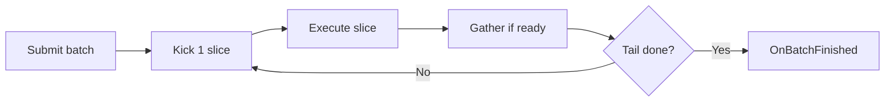

# DeferredJobs

Time-sliced background work for UE5, following Allen Chou's [Delayed Result Gathering][delayed-gathering] and [Time Slicing][time-slicing].

A full sweep, a few thousand exposure traces in our case, rarely fits into a single frame. This module breaks that sweep into slices, kicks one slice per tick, and merges the results a tick later, so the game thread keeps moving and never waits on the work it started.

Jobs implement [`ITimeSlicedJob`][itime-sliced-job]; [`UDeferredWorkSystem`][deferred-work-system] owns the batches and ticks them forward.

## How it works



Each tick, for each batch:

1. Gather the slice kicked on an earlier tick, if ready - never blocks waiting.
2. If the tail was kicked and gathered, run [`OnBatchFinished()`][on-batch-finished] and remove the batch.
3. Otherwise kick one new slice:
   - [`ExecuteRange()`][execute-range] runs inline on the game thread, or
   - via `Async(ThreadPool)` on a worker.

Guarantees:

- Only one slice is ever pending per batch, so executing and gathering never overlap.
- Worker slices are polled with `TFuture::IsReady()`.
- Game-thread slices become due for gathering on the next tick.

## Writing a job

The contract is [`ITimeSlicedJob`][itime-sliced-job] (see [`TimeSlicedJob.h`][time-sliced-job-h]):

- [`GetTotalWork()`][get-total-work] - declares how many items exist in total.
- [`ExecuteRange()`][execute-range] - handles one `[Base, Base + Count)` window, on the thread chosen by [`GetDesiredThread()`][get-desired-thread].
- [`GatherRange()`][gather-range] - merges that same window on the game thread; bounded work that always makes progress so the pipeline keeps flowing.
- [`OnBatchFinished()`][on-batch-finished] - swaps buffers, broadcasts the result, optionally starts the next sweep; game thread.

Constraints:

- Snapshot all inputs at construction on the game thread - a worker [`ExecuteRange()`][execute-range] never touches `UObject`s or `UWorld`.
- Keep a slice-local staging buffer per job:
  - `Execute` writes into it,
  - `Gather` copies it into the back buffer,
  - readers keep using the front buffer until the swap.

Skeleton:

```cpp
class FMyCountJob : public ITimeSlicedJob
{
public:
    FMyCountJob(TArray<float>&& InValues) : Values(MoveTemp(InValues))
    {
        Back.Init(0.0f, Values.Num());
    }

    int32 GetTotalWork() const override { return Values.Num(); }
    EDeferredJobThread GetDesiredThread() const override
    {
        return EDeferredJobThread::WorkerThread;
    }

    void ExecuteRange(const FJobSlice& Slice) override
    {
        Staged.Reset();
        for (int32 i = 0; i < Slice.Count; ++i)
        {
            Staged.Add(Values[Slice.Base + i] * 2.0f);
        }
    }

    void GatherRange(const FJobSlice& Slice, FTimeBudget& Budget) override
    {
        FMemory::Memcpy(Back.GetData() + Slice.Base, Staged.GetData(),
            Staged.Num() * sizeof(float));
        Staged.Reset();
    }

    void OnBatchFinished() override { ::Swap(Front, Back); }

private:
    TArray<float> Values;
    TArray<float> Front;
    TArray<float> Back;
    TArray<float> Staged;
};

// Game thread:
TSharedPtr<FMyCountJob> Job = MakeShared<FMyCountJob>(MoveTemp(Data));
FDeferredJobHandle Handle = System->Submit(Job, 256);
// Later: System->IsDone(Handle)
```

Working example:

- [`ExposureTraceJob.h`][exposure-trace-job-h] - turns a trace sweep into a job.
- [`Observer.cpp`][observer-cpp] - submit-once-per-sweep flow.

## API

[`UDeferredWorkSystem`][deferred-work-system] is a `UWorldSubsystem` and `FTickableGameObject`, and its calls run on the game thread.

- [`Submit()`][submit] starts a batch and returns a handle; that handle is needed for [`Cancel()`][cancel] or polling.
- [`Cancel()`][cancel] drops a batch without blocking. A worker slice already in flight still finishes, but its result is discarded.
- [`IsDone()`][is-done] and [`Poll()`][poll] report true once a batch has finished or been cancelled, with unknown handles reading as done.
- [`GetProgress()`][get-progress] reports how much has been gathered so far, which suits progress bars.
- [`SetNumPerSlice()`][set-num-per-slice] retunes the granularity, taking effect from the next kick.

Internals:

- [`NextBase`][next-base] is the kick cursor, with `-1` marking that the tail has been kicked.
- The batch completes once that tail slice is gathered.

## Thread choice

- `GameThread` - for line traces, physics, or anything touching `UObject`s:
  - tracing and merging still land on different ticks,
  - so no single tick pays for both.
  - See [`EDeferredJobThread`][deferred-job-thread].
- `WorkerThread` - for pure data work on the shared `ThreadPool`:
  - traces cannot move here without `AsyncLineTrace` or an explicit scene lock.

## Tuning

In `DefaultGame.ini`:

```ini
[/Script/DeferredJobs.DeferredWorkSystem]
GatherBudgetMs=0.5
MaxKicksPerTick=4
```

- [`GatherBudgetMs`][gather-budget-ms] - cap on total merge time per tick across all batches:
  - each tick gets one deadline from this value (default `0.5` ms, `Config`);
  - when the deadline passes, gathering pauses and the rest waits for the next tick, including new kicks;
  - lower it to smooth frames at higher latency, raise it to finish batches sooner at higher per-tick cost.
- [`MaxKicksPerTick`][max-kicks-per-tick] - total slice kicks per tick across all batches.
- `NumPerSlice` (per [`Submit()`][submit]) - granularity:
  - smaller slices spread cost over more frames at higher latency;
  - rule of thumb: 10% of the work per slice costs roughly a tenth of the frame time across about ten frames of latency.

## Profiling

Overlay (`stat DeferredJobs` in a PIE console, `STATCAT_Advanced` so it is free when off):

- `Tick (all batches)` - total system cost this tick.
- `Kick slice` / `Gather slice` / `Finish batch` - the split of that total.
- `Active batches` - live batch count (`SET` each tick).
- `Rays gathered` - per-frame merged count (`INC` per gather).

The overlay reports totals; per-batch detail lives in Insights.

Timing Insights (`-cpuprofilertrace`):

- One `DeferredJobsTick` row plus `Kick <Name> [N rays]`, `Gather <Name> [N rays]`, and `Finish <Name>` events. `<Name>` comes from [`GetStatName()`][get-stat-name], so override it per job or concurrent batches blur together.

Reading the numbers:

- `Gather` high with `Rays gathered` flat - slices are likely too big or [`GatherBudgetMs`][gather-budget-ms] too low, so reduce the per-[`Submit()`][submit] granularity.
- `Active batches` keeps growing - kicks are starved by [`MaxKicksPerTick`][max-kicks-per-tick] or an exhausted gather budget, so compare `Tick` against the budget.
- `Kick` high on `GameThread` jobs - this is expected since traces run there; the win is that the trace tick and the merge tick differ, not that tracing became free.

## Files

- [`TimeSlicedJob.h`][time-sliced-job-h] - the [`ITimeSlicedJob`][itime-sliced-job] contract.
- [`DeferredWorkSystem.h`][deferred-work-system-h] / [`DeferredWorkSystem.cpp`][deferred-work-system-cpp] - batch ownership and tick pipeline.
- [`JobSlice.h`][job-slice-h] - `[Base, Base + Count)` window.
- [`TimeBudget.h`][time-budget-h] - seconds-deadline budget for gather work.
- [`JobHandle.h`][job-handle-h] - opaque handle, `Id 0` is invalid.
- [`DeferredJobsLog.h`][deferred-jobs-log-h] - `LogDeferredJobs` category.

[//]: # (External links)

[delayed-gathering]: <https://allenchou.net/2021/05/delayed-result-gathering/>
[time-slicing]: <https://allenchou.net/2021/05/time-slicing/>

[//]: # (Job contract)

[itime-sliced-job]: <Public/TimeSlicedJob.h#L26>
[get-total-work]: <Public/TimeSlicedJob.h#L31>
[get-desired-thread]: <Public/TimeSlicedJob.h#L32>
[get-stat-name]: <Public/TimeSlicedJob.h#L35>
[execute-range]: <Public/TimeSlicedJob.h#L37>
[gather-range]: <Public/TimeSlicedJob.h#L38>
[on-batch-finished]: <Public/TimeSlicedJob.h#L39>
[deferred-job-thread]: <Public/TimeSlicedJob.h#L9>

[//]: # (System API)

[deferred-work-system]: <Public/DeferredWorkSystem.h#L27>
[submit]: <Public/DeferredWorkSystem.h#L40>
[set-num-per-slice]: <Public/DeferredWorkSystem.h#L41>
[cancel]: <Public/DeferredWorkSystem.h#L42>
[is-done]: <Public/DeferredWorkSystem.h#L43>
[poll]: <Public/DeferredWorkSystem.h#L44>
[get-progress]: <Public/DeferredWorkSystem.h#L45>
[next-base]: <Public/DeferredWorkSystem.h#L63>
[gather-budget-ms]: <Public/DeferredWorkSystem.h#L34>
[max-kicks-per-tick]: <Public/DeferredWorkSystem.h#L38>

[//]: # (Module files)

[time-sliced-job-h]: <Public/TimeSlicedJob.h>
[deferred-work-system-h]: <Public/DeferredWorkSystem.h>
[deferred-work-system-cpp]: <Private/DeferredWorkSystem.cpp>
[job-slice-h]: <Public/JobSlice.h>
[time-budget-h]: <Public/TimeBudget.h>
[job-handle-h]: <Public/JobHandle.h>
[deferred-jobs-log-h]: <Public/DeferredJobsLog.h>

[//]: # (Consumer example)

[exposure-trace-job-h]: <../Multithread/Public/Jobs/ExposureTraceJob.h>
[observer-cpp]: <../Multithread/Grid/Observer.cpp>
