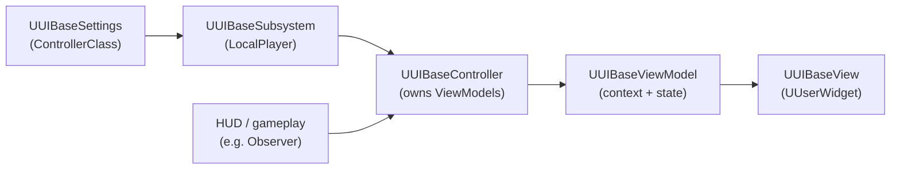

# UIBase

Thin per-player MVVM base for UE5, built on the `ModelViewViewModel` plugin
(`UMVVMViewModelBase` + `UMVVMView` extension on `UUserWidget`) and `UMG`.
One `UUIBaseController` per `ULocalPlayer` owns cached ViewModels; Views bind
in Widget Blueprints via `FieldNotify`.

## How it fits

Each tick consumers resolve lazily: `Subsystem -> GetController() ->
GetOrCreateViewModel(Class)`. No widget creation here; the Controller only
hands out ViewModels.

## Roles

- [`UUIBaseController`](Public/UIBaseController.h) — per-class VM cache.
  Rejects null/abstract classes, `NewObject(this)` + `Initialize(this)`.
  `ReleaseViewModel` deinitializes and drops. `RequestScreen(ScreenTag)` +
  `OnScreenRequested` multicast for screen intent (`FGameplayTag`).
- [`UUIBaseViewModel`](Public/UIBaseViewModel.h) — base for every VM.
  Idempotent `Initialize(Context)` / `Deinitialize()`, weak `Context`,
  `GetWorld()` via Context else Outer (CDO guard). `OnInitialize` /
  `OnDeinitialize` are `BlueprintNativeEvent` hooks.
- [`UUIBaseView`](Public/UIBaseView.h) — `UUserWidget` base. `SetViewModel()`
  forwards to `UMVVMSubsystem::GetViewFromUserWidget() ->
  SetViewModelByClass()` (warns on failure), then `OnViewModelSet()` BP event.
  `NativeDestruct()` clears the pointer.
- [`UUIBaseSubsystem`](Public/UIBaseSubsystem.h) — `ULocalPlayerSubsystem`.
  `PlayerControllerChanged()` destroys the old Controller and builds the class
  from [`UUIBaseSettings`](Public/UIBaseSettings.h) (must be non-abstract
  `UUIBaseController` child). `Deinitialize()` destroys it.
- [`UUIBaseSettings`](Public/UIBaseSettings.h) — `UDeveloperSettings`
  (`Config=Game`, `Project Settings > Game > UIBase`), `TSoftClassPtr`
  `ControllerClass`.

Deps (`UIBase.Build.cs`): `Core`, `UMG`, `ModelViewViewModel`,
`FieldNotification`, `GameplayTags`, `DeveloperSettings`.

## Adding a screen

1. Subclass `UUIBaseViewModel` (state, `FieldNotify` props, outward delegates)
   and `UUIBaseView` (empty shell; bindings live in the Widget BP).
2. Optionally subclass `UUIBaseController` for screen-specific resolve logic.
3. Set `ControllerClass` in `Project Settings > Game > UIBase`.
4. Resolve where needed, e.g. HUD or component tick:
   `LocalPlayer->GetSubsystem<UUIBaseSubsystem>()->GetController()->
   GetOrCreateViewModel(UMyViewModel::StaticClass())`.
5. Push state with a change guard + `UE_MVVM_BROADCAST_FIELD_VALUE_CHANGED`,
   so bound widgets re-evaluate only when a value moved. Send UI intent outward
   via a multicast delegate the gameplay side subscribes to.

Working example: `URaysViewModel` / `URaysControl` (`Source/Multithread/UI/`) —
`SliderValue` (`FieldNotify`) + `GetDisplayText()`, `SetBatchStats()` guarded
push from `UObserver`, `OnSliderValueRequested` delegate back to gameplay;
`AMultithreadHUD::GetRaysViewModel()` and `UObserver::ResolveViewModel()`
show the lazy-resolve pattern.

## Notes

- Game thread only. Controller/ViewModels are `UObject`s owned by the
  Subsystem (`Outer` chain: Subsystem -> Controller -> ViewModel).
- Controller may not exist yet (`PlayerControllerChanged` hasn't run).
  Consumers poll and stay silent — see `UObserver::ResolveViewModel()`.
- `BeginDestroy()` on the Controller calls `Deinitialize()`; Views drop their
  VM reference in `NativeDestruct()`.

## Tests

- `UIBase.Controller.ViewModelCache` (`Private/Tests/UIBaseControllerTest.cpp`):
  create / cache hit / different-class / null / abstract / release /
  recreate-after-release.
